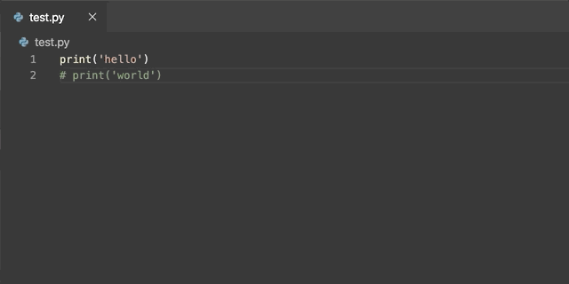

# Magic Comment README

A magic comment command.

## Features

- **Magic Comment** A magic comment command, which will comment the uncomment part and uncomment the comment part when the selection content contains both of them.

## Keyboard Shortcuts

| Key                            | Command       |
| ------------------------------ | ------------- |
| <kbd>Ctrl</kbd> + <kbd>/</kbd> | Magic Comment |

## Release Notes

### 1.1.0

- Make it work in multi-cursor
- Skip the empty line (advise by [d0ob](https://github.com/d0ob))

### 1.0.0

Initial release of magic comment.

**Enjoy!**
